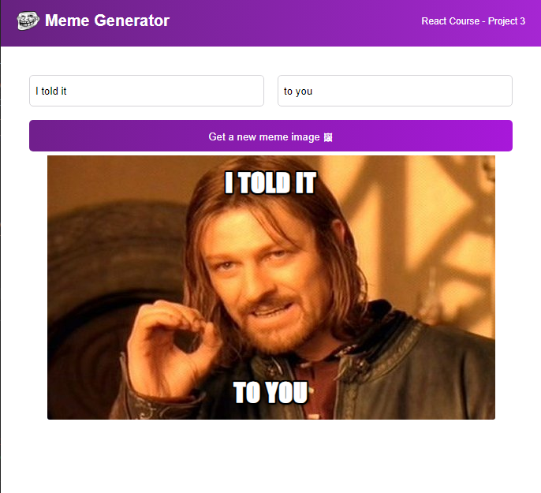

# Meme Generator

Set up the project, the goal here is to make a Meme Generator using React. Design from [Figma](https://www.figma.com/file/MoLwFPHNHJVrzdFurxHzNV/Meme-Generator?type=design&node-id=2-2&mode=design&t=li4M8nPx9DhTrj2O-0)

## Design

## Meme Generator

## Built With

- HTML
- CSS
- JavaScript
- React
- Vite

### Prerequisites
- GIT 

### Setup
- Clone this [Repository](https://github.com/danyhoshi/memeGenerator) in order to get a copy of this project
- From develop branch, open the index.html file with your browser.

## Author

- GitHub: [@danyhoshi](https://github.com/danyhoshi)
- LinkedIn: [@LinkedIn](https://www.linkedin.com/in/daniela-gonz%C3%A1lez-ba16a556/)
- Twitter: [@dany_hoshi](https://twitter.com/Dany_hoshi)

## Contributing

Contributions, issues, and feature requests are welcome!

Feel free to check the [issues page](../../issues/).

## Show your support

Give a ⭐️ if you like this project!

## Acknowledgments

- Scrimba. 
- Our Studying group.

## 📝 License

This project is [MIT](./MIT.md) licensed.
